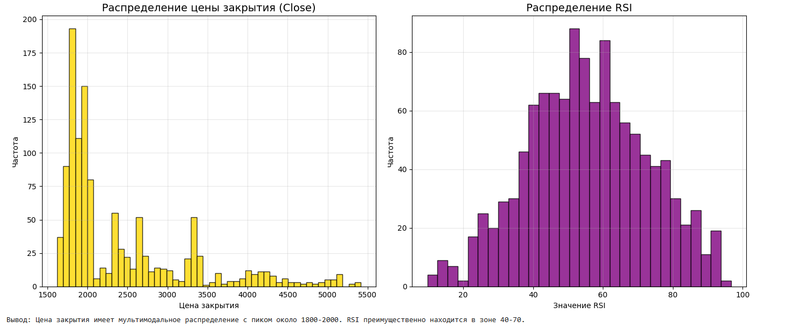
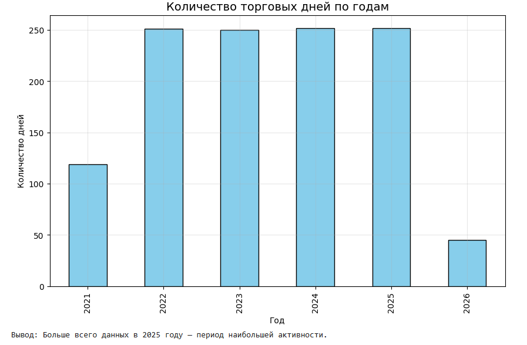
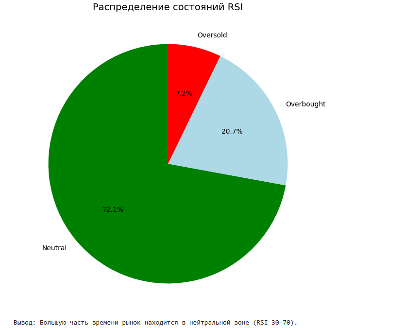
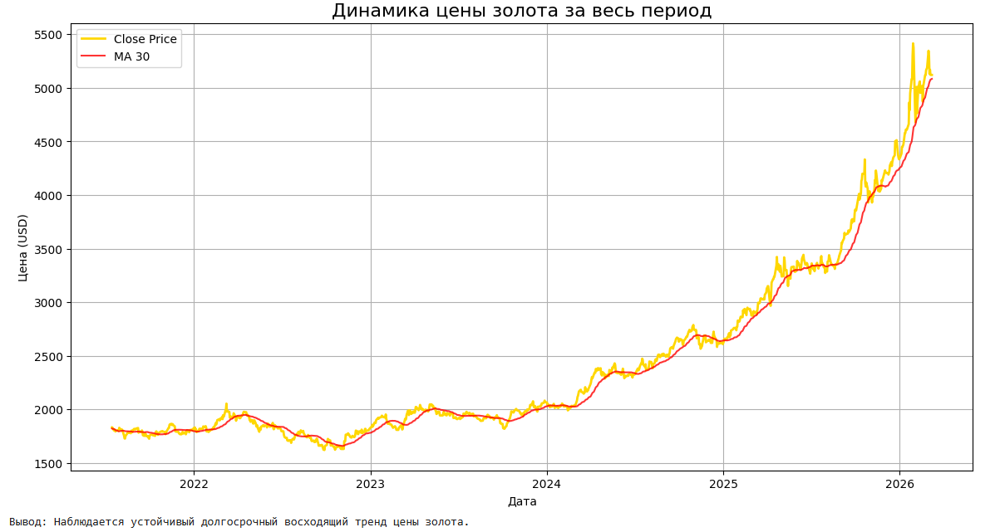
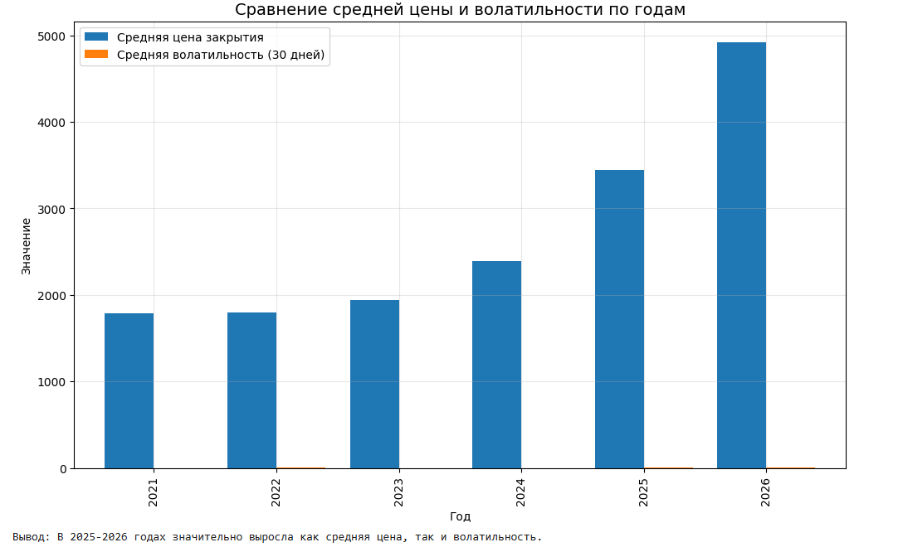

# Анализ фьючерсов на золото (Gold Futures)

**Проект по анализу данных** — курс "Системы искусственного интеллекта"

## Описание проекта

Анализ исторических данных фьючерсов на золото (тикер GC=F) за период 2021–2026 гг.  
Датасет содержит OHLCV цены и 11 технических индикаторов.

### Цели проекта:
- Загрузка и первичная обработка данных
- Очистка данных (обработка пропусков)
- Проведение разведочного анализа (EDA)
- Построение требуемых графиков визуализации
- Формирование выводов о наборе данных

---

## Структура проекта

```bash
gold-futures-analysis/
├── gold_futures_analysis.ipynb     # Основной Jupyter Notebook (Colab)
├── gold_futures_timeseries.csv     # Исходный датасет
├── README.md
└── images/                         # Папка с визуализациями
    ├── histograms.png
    ├── bar_years.png
    ├── pie_rsi.png
    ├── price_ma.png
    └── comparative_bar.png
```
Основные выводы

Цена золота демонстрирует сильный долгосрочный восходящий тренд за 5 лет (более чем удвоилась).
Наблюдается значительное увеличение волатильности в 2025–2026 годах.
RSI чаще всего находится в нейтральной зоне (30–70).
Технические индикаторы (MA, RSI, MACD) хорошо отражают рыночные движения.
Наиболее важные признаки: close, ma_7, rsi, macd, volatility_30.


Визуализации
1. Гистограммы распределения числовых признаков

Вывод: Распределение цены закрытия мультимодальное, RSI преимущественно в диапазоне 40–70.
2. Столбчатая диаграмма (Количество дней по годам)

Вывод: Наибольшее количество данных приходится на 2025 год.
3. Круговая диаграмма состояний RSI

Вывод: Большую часть времени рынок находится в нейтральной зоне.
4. Линейный график динамики цены

Вывод: Устойчивый восходящий тренд цены золота за весь период.
5. Сравнительная столбчатая диаграмма (Цена и волатильность по годам)

Вывод: В 2025–2026 годах одновременно выросли как средняя цена, так и волатильность.

Технологии

```bash
Python
pandas — обработка данных
matplotlib + seaborn — визуализация
Google Colab
```


Автор: Тарасов Сергей
Дата: Май 2026
